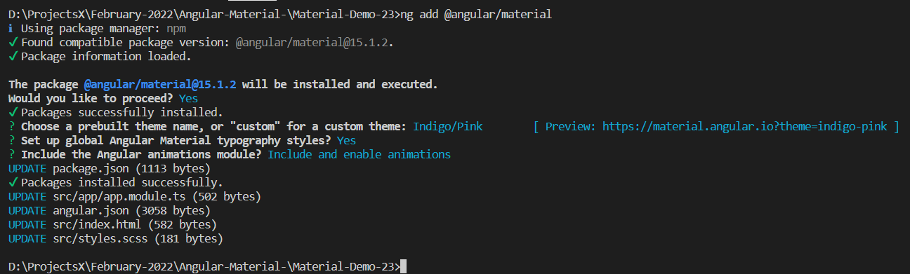
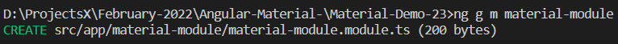
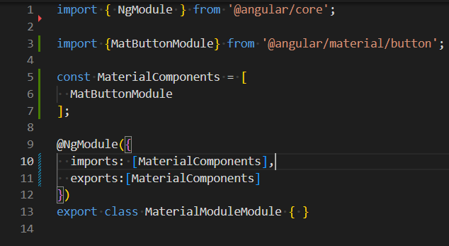
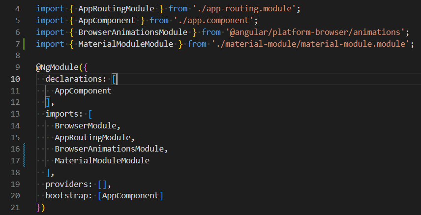
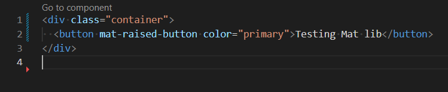
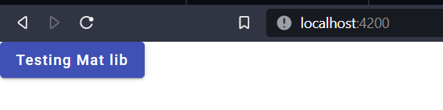

# Angular-Material

#### Day 1: Intro to Angular Material.

###### Q: What is angular material?
###### A: Angular material is an UI component library.

- It means that this library provides us with components to build awesome UI with inbuilt/pre existing code quickly.
- It is mainly the angular's implementation(flavour) to the Google's material design specification.
- There are many flavours of Google's material design for example   React has material UI, Vue has vuetify etc.
  
#### Pre-requisites:
- Html, css, JS, Angular(basics).

#### Course Structure:
- How to add angular to project.
- Typography
- Components
    - Buttons and Indicators
    - Navigation
    - Layout
    - Form controls
    - Popups and modals
    - Data tables

#### Adding Material to our project:
- To install Angular material in our project we need to use the command <code>npm add @angular/material</code>.
- This command will add schematics to our project and will make some changes to our project.
  
  - App.module.ts - This file will be injected with browseranimations module to support material animations.
  - Angular.json - This file will be updated with the angular material css links.
  - Package.json - This file is updated with the current available angular material version and cdk.
  - Package.lock.json - This file is updated with some configuration. (we can prolly ignore this).
  - Index.html - In this file links(of google fonts cdn) are added in head section of the file. and body style is set to mat-typography.
  - Styles.css - In this file some css reset(margin and padding to 0) takes place and roboto font is imported and used as default font.
> Now to ensure that material is working fine just run the app using <code>ng serve</code> and see if you notice any change in font and if so then material UI is working fine and we are good to go further.

### Day 2: Material Module.
- As you work more and more with material UI you end up with importing almost all the modules into the **app.component.ts file** which looks cluttered.
  
- So to maintain professionalism it is recommeded to follow the material module approach as a good practice.
- So, What is this approach?
    - It is nothing. Just create a module file and name it material module(as it contains all material modules import).
    - Create it using the command <code>ng g m material-module</code>
    - And instead of importing all the material UI components in **app.module.ts** just import them into material module by creating an components array and exporting them instead.
    - Follow below screenshot for more Also see the it log history to know in depth about which files are being affected at each step.
  
  

#### Testing Material Module:
To test the mat lib just edit the app.comp.html and use mat-button to see the effects.
  
  

